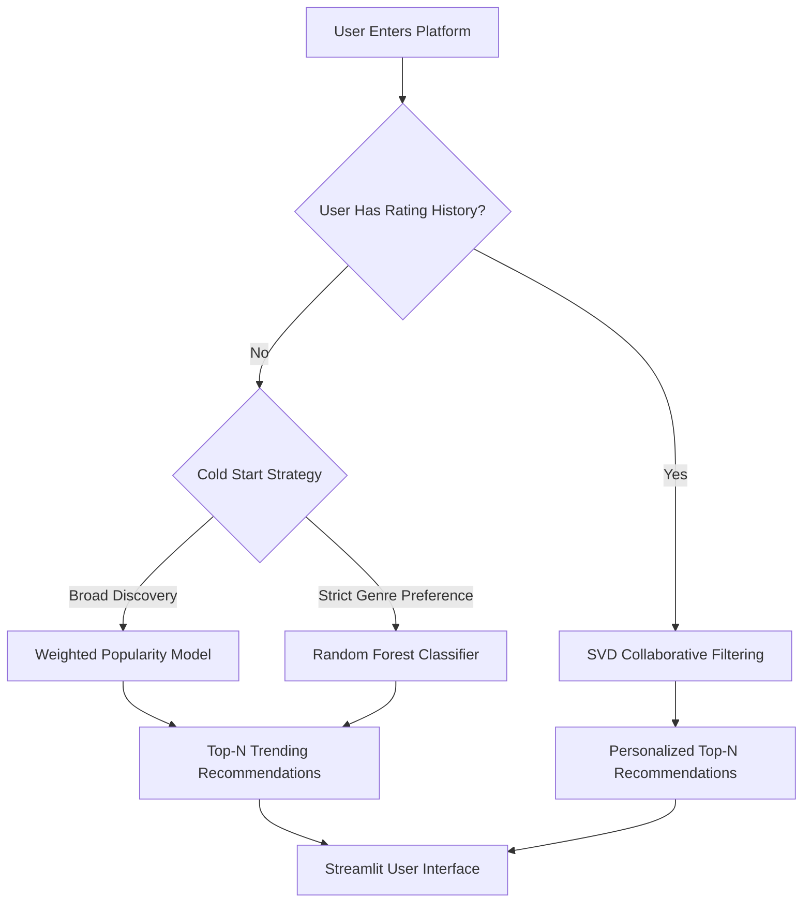

# MovieRec - Intelligent Hybrid Movie Recommendation Engine 🎬


**MovieRec** is a production-grade recommendation system designed to deliver personalized movie suggestions using a hybrid approach. It combines **Content-based Recommendation ( Using SVD)** with **IMDB Weighted Popularity algorithms and Using RandomForest Classifier Model** to handle cold-start scenarios and provide actionable insights for streaming platforms.

---

## 📖 Table of Contents

* [About the Project](#-about-the-project)
* [Key Features](#-key-features)
* [System Architecture](#-system-architecture)
* [Technology Stack](#-technology-stack)
* [Data Source](#-data-source)
* [Installation & Setup](#-installation--setup)
* [Project Structure](#-project-structure)
* [Business Insight](#-business-value-of-the-hybrid-approach)
* [Future Improvements](#-future-improvements)
* [Contributors](#-contributors)
* [License](#-license)

---

## 💡 About the Project

The streaming industry faces **Information Overload** for users and **Content Value Decay** for platforms.
**MovieRec** addresses these challenges by:

* **Personalizing Experience:** Uses SVD to uncover hidden user preferences.
* **Solving Cold Start:** Implements Weighted Popularity with genre filtering for new users.
* **Strategic Analytics:** Provides dashboards to analyze content retention and long-tail distribution.

It transforms raw user ratings and movie metadata into actionable recommendations and insights.

---

## ✨ Key Features

---

### 🎯 Hybrid Recommendation Engine

MovieRec employs a **context-aware hybrid recommendation strategy**, dynamically selecting the most effective model based on user availability and data maturity.

---

* **New User (Cold Start):**
When a user has **no historical rating data**, MovieRec avoids collaborative filtering and applies one of the following cold-start strategies:
### 1. Weighted Popularity-Based Recommendations

* Uses a **Weighted Popularity Score** inspired by IMDb’s ranking formula.
* Prioritizes movies with both **high ratings** and **sufficient vote counts**.
* Supports **genre and release-year filtering**.
* Ideal for **broad discovery** and first-time engagement.


---

### 2. Genre-Based Machine Learning Recommendations

* Uses a **Random Forest Classifier** trained on historical movie features and ratings.
* Generates recommendations **strictly within user-selected genres**.
* Best suited for users with **strong, narrow preferences**.


---

## 👤 Existing User (Personalized)

### 🔵 Collaborative Filtering (SVD)

* Applies **Singular Value Decomposition (SVD)** to uncover latent user–item relationships.
* Predicts personalized movie ratings based on **past user behavior**.
* Enables discovery beyond explicit genres by learning **hidden taste patterns**.


---

### 📊 Interactive Analytics Dashboard

* **Content Value Decay:** Shows how classic movies (1980–2000) maintain higher ratings than modern releases.
* **Long Tail Analysis:** Visualizes rating distribution per movie and user activity.
* **Quality Segmentation:** Displays percentage breakdown of Best (4.5+), Average, and Bad content.
  

### 🧠 Explainable AI (XAI)

* **Contextual Recommendations:** Explains suggestions using the user’s viewing history (e.g., “Because you liked *The Matrix*…”).

---

## 🏗 System Architecture

MovieRec uses a **batch-processing pipeline** to optimize cloud resources:


---

## 🔀 Recommendation Decision Flow



---

## 💼 Business Value of the Hybrid Approach

From a platform strategy perspective, this hybrid design ensures:

* **Immediate value for new users**, improving onboarding and retention.
* **Deep personalization** for returning users without expensive real-time training.
* **Balanced catalog utilization**, combining blockbuster appeal with long-tail discovery.
* **Operational efficiency** through batch-trained, lightweight deployment artifacts.

---

* **Offline Training:** Models trained on Google Colab using scikit-surprise.
* **Batch Inference:** Top-N recommendations pre-computed and stored in optimized Parquet/CSV files.
* **Online Inference:** Streamlit app serves recommendations instantly using lightweight artifacts.

---

## 🛠 Technology Stack

* **Frontend:** Streamlit
* **Data Processing:** Pandas, NumPy
* **Machine Learning:** Scikit-Surprise (SVD), Scikit-Learn (Random Forest)
* **Visualization:** Altair, Matplotlib, Seaborn
* **Data Storage:** Parquet for efficient deployment

---

## 💾 Data Source

* **MovieLens (ml-latest) dataset** from GroupLens Research
* **Ratings:** 5-star scale from 330,975 users
* **Movies:** 86,537 titles with genres
* **Genome:** Tag relevance scores for content-based filtering

> Note: Raw CSV files (like ratings.csv) are excluded. Optimized Parquet files are used for deployment primarily because of GitHub storage limit.

---

## 🚀 Installation & Setup

### Prerequisites

* Python 3.8+
* pip

### Steps

1. **Clone the Repository**

```bash
git clone https://github.com/YourUsername/MovieRec.git
cd MovieRec
```

2. **Install Dependencies**

```bash
pip install -r requirements.txt
```

3. **Run the Application**

```bash
streamlit run app.py
# or
python -m streamlit run app.py
```

---

## 📂 Project Structure

```
MovieRec/
├── app.py                     # Main Streamlit application
├── requirements.txt           # Python dependencies
├── movies.parquet             # Optimized Movie Metadata
├── ratings.parquet            # Optimized User Ratings
├── user_recommendations.csv   # Pre-computed SVD predictions
├── README.md                  # Project Documentation
├── final_ml_team.py           # Python version of Colab notebook
└── Final_ML_Team.ipynb        # Colab notebook for Training & Analysis
```

---

## 🔮 Future Improvements

* Real-time recommendation updates
* Integration with streaming platform APIs
* Enhanced visualization dashboards for business insights
* Advanced hybrid models combining content-based and collaborative-based filtering

---

## 👥 Contributors (Group 8)

* Irene - Lead Developer
* Joshua Agyemang - Data Analyst
* Velma Atieno - Research & Documentation
* Chika Amanna @AmannaP - ML Engineer

---

## 📝 License

This project is for educational purposes under the MIT License. Dataset usage is governed by the Group 8 Usage License.

---

**Built with 💜 to make movie recommendations smarter and more personalized.**
